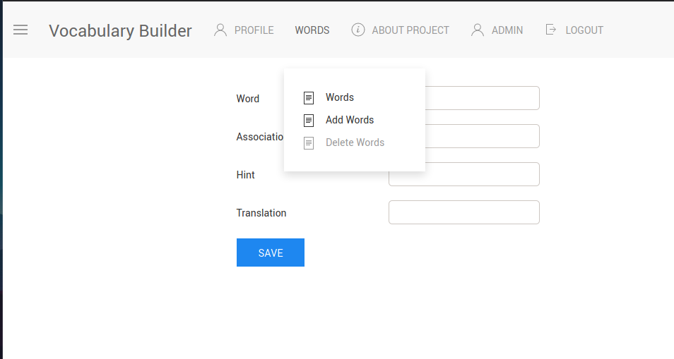
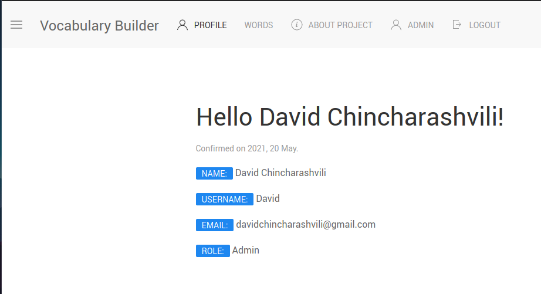

# Vocabulary builder
---

<!--- These are examples. See https://shields.io for others or to customize this set of shields. You might want to include dependencies, project status and licence info here --->

მოცემული საიტის მეშვეობით შესაძლებელია უცხო/ახალი სიტყვების დამახსოვრება [მნემონიკის](https://youtu.be/2SRxhl2CLRw?t=61) მეშვეობით. 

